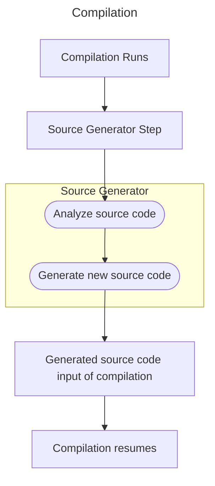

# BASTA! 2023 Frankfurt

## What's cool with C# 11 and .NET 7

Jährlich gibt es neue Features in C# und .NET. Auch C# 11 bietet wieder neue Funktionalität um die Produktivität zu erhöhen. Raw String Literals sind eine neue Möglichkeit in C#, Strings zu definieren, die Code beinhalten. In dieser Session lernen Sie die Grundlagen der neuen Syntax und wie Sie diese in Ihren Projekten einsetzen können. Required Members, Erweiterungen beim Pattern Matching, Generic Math sind weitere Features werden in dieser Session vorgestellt.

[Slides C# 11](slides/CSharp11.pdf)

### Samples

* [Struct Enhancements](csharp11/01_StructEnhancements)
* [Required](csharp11/02_NominalTypes/)
* [Default Interface Methods](csharp11/03a_DefaultInterfaceMethods/)
* [Abstract Static Interface Members](csharp11/03b_AbstractStatic/)
* [Parsing using static interface members](csharp11/03c_ParseSample)
* [Generic math](csharp11/04_MathSample)
* [Pattern matching](csharp11/05_PatternMatching)
* [Virtual Members with List Patterns](csharp11/05_VirtualMembersListPatterns)
* [String Literals](csharp11/06_StringLiterals)
* [AOT](csharp11/07_AOT)

## Generating Source Code with Source Generators

Source Generators sind eine neue Möglichkeit, Code zu generieren. Der Code wird dabei schon während des Tippens im Editor erzeugt. Damit steht IntelliSense auch gleich zur Verfügung. In dieser Session lernen Sie die Grundlagen der neuen Generation der Source Generators und wie Sie Source Generators, die bereits mit .NET mitgeliefert werden, in Ihren Applikationen verwenden können, darunter z. B. für Logging, JSON-Serialisierung, EF Core, SignalR ASP.NET Core und mehr.

[Slides Source Generators](slides/SourceGenerators.pdf)

### Samples

#### Roslyn

* [Syntax Query](roslyn/SyntaxQuery)
* [Syntax Walker](roslyn/SyntaxWalker)
* [WPF Syntax Tree](roslyn/WPFSyntaxTree)
* [Transform Methods](roslyn/TransformMethods)
* [Syntax Rewriter](roslyn/SyntaxRewriter)
* [Semantics Compilation](roslyn/SemanticsCompilation)

#### Using Source Generators

* [Regular Expressions](usingsourcegenerator/RegularExpressionSample)
* [JSON Serialization](usingsourcegenerator/JsonSerialization)
* [Platform Invoke](usingsourcegenerator/PInvoke)
* [Logging](usingsourcegenerator/LoggingSample)
* [Blazor with JavaScript Interop](usingsourcegenerator/BlazorWasmSample/)
* [Experimental WASM from the browser with JavaScript Interop](usingsourcegenerator/wasmbrowser)
* [Communitytoolkit.MVVM](sourcegenerator/MVVM-After)
* [Instant API](sourcegenerator/InstantAPISample)

> To use the Instant API sample, use `git submodule init` in the repo to initialize the configured submodule. 

#### Source Generator

* [Hello Source Generator including snapshot testing](sourcegenerator/01-hello)
* [Creating and using attributes](sourcegenerator/02-Attribute)
* [More complex pipeline](sourcegenerator/03-MoreGeneric)

## Important Links

[My Blog - C#, .NET, Azure](https://csharp.christiannagel.com)
